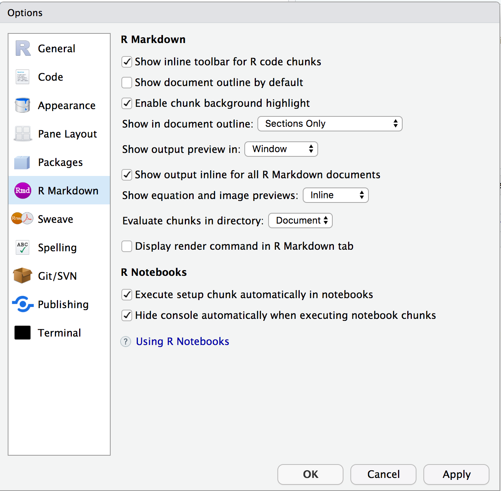

```{r setup, include=FALSE}
knitr::opts_chunk$set(echo = FALSE)
```


## Overview

A quick what and why to the installations and configurations:

### R

Although R is not generally revered as a hard core bioinformatic language/environment 
(but see [https://www.bioconductor.org/](https://www.bioconductor.org/), a set of R packages for 
HTS data that we won't use too much in this course), it is in widespread use
in ecology, and any chance to get more familiar with it is beneficial.

### RStudio

An integrated development environment (IDE) for writing R code (and much more).
This is where we will spend most of our programming time in this course, because it:

+ provides a fine editor for R, shell scripts, markdown, etc.
+ encourages organization of research into single-directory based _projects_ that make
tend to make one's work more easily reproduced.
+ Extraorinarily good integration with RMarkdown, which is a great markup language for
documenting your work at your computer (and presenting it...the website for this course
and all the lecture slides, etc. have been written using RMarkdown and extensions for
it maintained by the dedicated crew at RStudio).
+ provides an excellent interface to git and GitHub (see below.)

### Bash 

The so-called "Bourne-again shell" for dealing with Unix and writing Unix scripts.
Most of our hard-core bioinformatic analysis will take place on supercomputers, which all run
Unix.  However, it is really nice to have a Unix installation on your own laptop to experiment
with. Mac's are already Unix-based and come standard with bash, but Windows PCs are not.
Git Bash provides an environmentthat emulates a Unix shell on Windows.

### git

This is the underlying program that provides a "distributed version control" system.
We will go into more details of its inner workings later in the week.  You will use it
extensively to store versions of your homework, etc., and by the end of the semester I hope
that everyone is familiar enough with it to make use of it in their own research programs.

### GitHub

This is a website that lets you store copies of your work, research, code, etc.
In my opinion, it is one of the most important developments for doing reproducible and
collaborative research in the last decade.
All the materials for this course are served up from GitHub.  The course is also enrolled
in GitHub Classroom.  All homework assignments will be obtained and submitted through GitHub.

### Testing

At the end, we'll have everyone open a small RStudio project from GitHub to make
sure everything is working.


## R and Rstudio Installations

These are pretty easy to install on either Windows or a Mac.  The directions
are largely the same for either system.


### R

- On December 12, 2019, version 3.6.2 was released.
- That is the version we will be using.

1. Go to [https://cran.r-project.org/](https://cran.r-project.org/) and find the download link for your computer system.
1. Download it and install it. Just do a standard install, with all the default options.

**On Windows:** You should also go back to the cran downloads page and download and install the **Rtools35.exe**.  This will let you compile and build R packages on your computer.


### RStudio

1. We want the latest version of RStudio. 
1. Get the free desktop version from [https://rstudio.com/products/rstudio/download/](https://rstudio.com/products/rstudio/download/) 
1. install the appropriate one for your OS.

Once this is done, open RStudio and immediately set some settings:

* Choose RStudio -> Preferences, Choose "General" in the left panel, and with the "Basic" tab
selected make sure that "Restore .RData into workspace at startup" is **unchecked**. And that
"Save workspace to .RData on exit" is set to **Never**.  
* Then choose RMarkdowon from the left panel and make sure that your settings look like this:

```{r}

```


### Some R Packages

There are some packages that should be installed now.  Enter the lines of
code listed below (in the code blocks) into the R Console in RStudio.

- **bookdown:** This package is what I used to create these course notes.  Getting it automatically installs a lot of 
other packages that are useful for authoring reproducible research.
    ```{r get-bd, eval=FALSE, echo=TRUE}
    install.packages("bookdown")  
    ```
- **tinytex:** If you don't already have LaTeX installed, do the following so that you can be guided in maintaining a LaTeX distribution.  Basically, with this package installed,
if you try to create PDF output from an RMarkdown document, this package will detect that
and give you a message about how to install a LaTeX system.
    ```{r, get-tt, eval=FALSE, echo=TRUE}
    install.packages("tinytex")  
    ```

- **other R packages** that we will want to have, namely, the package `tidyverse`, which
installs a number of Hadley Wickham's packages, and also a package called `remotes` that
makes it easy to install packages from GitHub and other repositories..
    ```{r, othpack, eval=FALSE, echo=TRUE}
    install.packages(c("tidyverse", "remotes"))  
    ```


## Getting a Bash shell

### On a Mac

- This comes standard with OS X on a Macintosh. 
- You can access it from the Terminal app, and it also works just fine, driving it from RStudio...

### On Windows

Getting Bash on Windows is a little tougher than on a Mac.  I recommend
here that you get the **Git Bash** system, which gives you a serviceable
Unix-like command line for Windows.  And you get Bash in the process as well.  Yay!

You can follow these steps:

1. Download the Git For Windows Installer at [https://git-scm.com/download/win](https://git-scm.com/download/win)
1. Run the installer by double-clicking on the downloaded file and by following the steps bellow:
    - GNU GPL screen. Click on “Run”.
    - Select components.  Click on “Next” (use defaults).
    - Editor selection.  Choose "Use the Nano Editor by default." Click on “Next”.
    - Adjusting your PATH environment. Make sure "Git from the command line and also from third party software." is selected.  Click on “Next”.
    - Choosing HTTPS transport backend.  Stick with the default, Use the OpenSSL library." Click on “Next”.
    - Line endings.  Make sure Checkout Windows-style commit Unix style is selected (which is the default). Click on “Next”.
    - Use Windows' default console window.  Select the second option for Use Windows’ default console window and click on “Next”.
    - Configuring extra options.  Keep it as the default (top top boxes checked). Click on “Next”.
    - Experimental options.  Leave it unchecked. Click on “Install”.
    - When the install is complete, click on “Finish”.
1. Finally, in order to allow R to call system commands via this Git Bash shell (and to
allow shell code blocks in RMarkdown to work properly), you need to add its location
to your Windows Path Environment Variable.  Good directions for how to add a windows
path variable can be found [here](https://helpdeskgeek.com/windows-10/add-windows-path-environment-variable/).
Follow those directions and add the path `C:\Program Files\Git\bin` if it
is not already there.


## Getting git and telling rstudio where to find it

### On Windows

If you successfully installed Git for Windows, then you have git. You just have to
let RStudio where to find it.  

1. Go to Tools -> Global Options.
2. Select Git/SVN.
3. Make sure that the box next to "Enable version control interface for RStudio projects"
is checked.
4. Under Git executable you should see `C:/Program Files/Git/bin/git.exe`. If it is empty, try adding that text.


### On a Mac

You might already have git.  To find out do this:

- If you are using a Mac with a reasonably new OS,
you should be able to just open the Terminal application (`/Applications/Utilities/Terminal`) and type "git"
at the command line.  If you have `git` it will say something that starts like:
    ```{sh, eval=FALSE, echo=TRUE}
    usage: git [--version] [--help] [-C <path>] [-c name=value]
           [--exec-path[=<path>]] [--html-path] [--man-path] [--info-path]
           [-p | --paginate | --no-pager] [--no-replace-objects] [--bare]
           [--git-dir=<path>] [--work-tree=<path>] [--namespace=<name>]
           <command> [<args>]

These are common Git commands used in various situations:

start a working area (see also: git help tutorial)
   clone      Clone a repository into a new directory
   etc. etc. etc.
    ```
If you do not have `git` then it should pop up a little thing asking if you would like to install
a reduced set of developer tools.  You do.  Click OK.  **NOTE** Instead of a pop up it might say something
like, "xcrun Error: invalid active developer path. etc. etc...".  In that case, you can install a fresh set 
of command line tools by typing this at the command line:
    ```{sh, eval=FALSE, echo=TRUE}
    xcode-select --install
    ```

### On Linux

- If you are using Linux then we will assume you know how to get `git` or that you already have it.


## git configurations (name, keychain, editor)

There a few configurations to do for git:

### Name and email

When you use git, it stamps the changes with your name and email.  You need
to let it know those things, if you haven't already configured things.
You need to do this on both a PC and a Mac.

1. In RStudio, choose `Tools -> Terminal -> New Terminal`. That will pop up a Unix shell
in a new window in RStudio's lower left pane.
2. Type the following lines into that terminal window replacing John Doe and his email with your name
and your email, hitting return after each.
    ```{sh, eval=FALSE, echo=TRUE}
    git config --global user.name "John Doe"
    git config --global user.email johndoe@example.com
    ```


### Credential helper

On a Mac, there is one further step that will help you not have to
re-type your password every time git communicates with GitHub.  (On Windows,
if you installed Git/Bash for Windows according to the directions given earlier, 
this type of feature should already be enabled.
    ```{sh, eval=FALSE, echo=TRUE}
    git config --global credential.helper osxkeychain
    ```


## Get an account on GitHub

If you don't already have an account on GitHub, go to [github.com](github.com) and click the "sign up" link near upper right 
of the page.  It is pretty self-explanatory.  Go ahead and get a **free** account.  There is nothing to pay for here!

### Private repositories

_If you are a graduate student_ and you do not feel comfortable posting your data on a public site like
GitHub, then you should request some private repositories from GitHub.  GitHub has a great deal for academic
users like students: free private repositories.  Please go to [https://education.github.com/pack](https://education.github.com/pack)
to sign up for your free student pack.  


## Check out an Rstudio project and test your installations


I've prepared a small RStudio project and I have put it onto GitHub.  We can use this
to make sure that most of the installations are working properly.

Steps to get it:

1. Quit RStudio completely (in case it needs to detect any new paths that you
have set up)
1. Open RStudio
2. Choose File -> New Project...
3. In the dialog window choose "Version Control, checkout a project from a version control repository"
4. In the next dialog window choose "Git, clone a project from a Git repository"
5. In the next dialog window copy and paste the following URL into
the "Repository URL" text entry box:
    ```{sh, echo=TRUE, eval=FALSE}
    https://github.com/eriqande/minimal-test-of-installations
    ```
And then, using the "Browse" button, select a destination on your
local hard drive to save the resulting
RStudio project.  You should consider having a directory where all your work for
the course will go.  
6. Click "Create Project"

If everything goes right (i.e., if git is successfully installed) this will create
a new RStudio project and open up the associated project window for it.  

Now, from the file browser (bottom left pane, typically) click on `example.Rmd`.  When that
is open, click the "Knit" button on the top of the upper left pane.  

If all is right, this will bring up a new window some html output.  It should look
exactly like the file "expected-output.html" in the project.  You can open that file
by clicking on it in the RStudio file browser window and choosing "View in Web Browser."


## Create a New RStudio Project and Push it to GitHub

The last exercise was good for making sure that all the local installations were working.
Now, we want to make sure that you can push things up to your own GitHub account.

To do that. You will all create a new repository with git version control on your laptop, then
you will create a repository on GitHub and push your local repository up to it.

### Create a new RStudio Project

1. In RStudio, choose File -> New Project...
1. At the dialog window choose "New Directory"
1. At the next window ("Project Type") Choose "New Project"
1. At the next window ("Create New Project") Under "Directory name" enter "a-first-project".
That is the name for this project.  Then select where on your hard drive that should be.  And finally, this is very important, **be sure to check the box for "Create a git repository."**.  Then click "Create Project."

### Commit your files and play with git

Once you have created that project, we will talk a little about how git works, and
about RStudio's interface to it.

### Initialize an empty repository on GitHub and push your repository to it

Make it public. No README, no other initializations.

### Do successive commits and pushes and pulls 

Make sure that password caching is working.


